# E-Commerce Platform Deployment with Git, Linux, and AWs
This project is about developing an e-commerce website for a new online marketplace named 'Marketpeak.
## Implementing Version Control with Git
## Initialize Git Repository
- Creating a new directory for the MarketPeak_Ecpmmerce with `mkdir` syntax
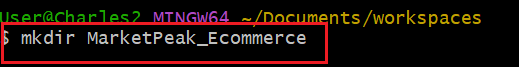
- Change to MarketPeak_Ecommerce directory with `cd` syntax.
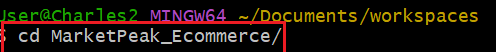
- Initializing using `git Init` syntax.
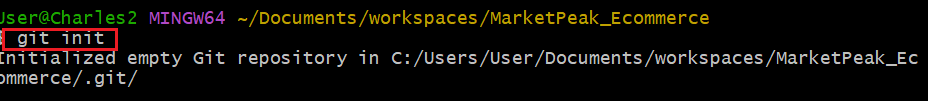
## Obtaining the E-commerce website template.
- The website template was downloaded and stored in the created directory
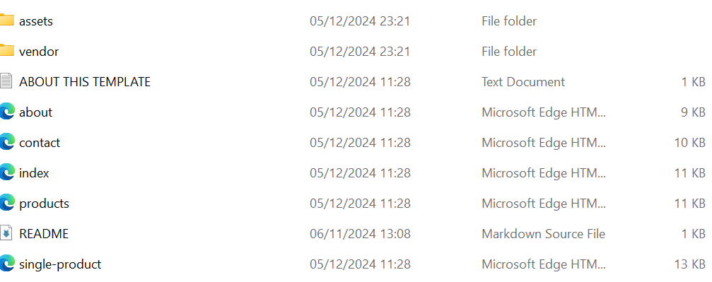
## Stage and commit the Template to Git.
- Add all created files to remote repository using `git add .` synatx.
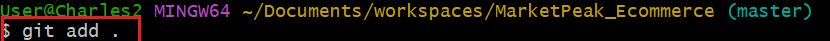
- Setting git global configuration.
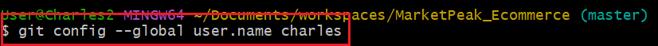
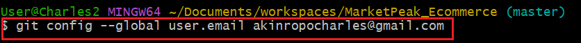
- commit all added files
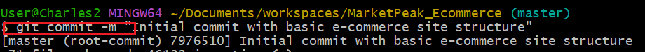
## Create and push code to Github repository.
- creating a remote ropository on gitup account

- linking Gitup to local machine.
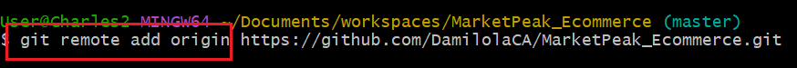
- Push all added files with `git push -u origin mai` syntax.
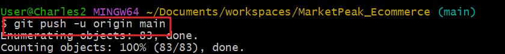
# AWS Deployment
## setting uo an AWS EC2 instance
- create ec2 instance.

- Change user mode for EC2 read only `chmod 400` syntax
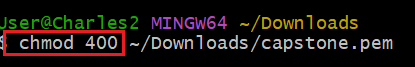
- Connecting to an ec2
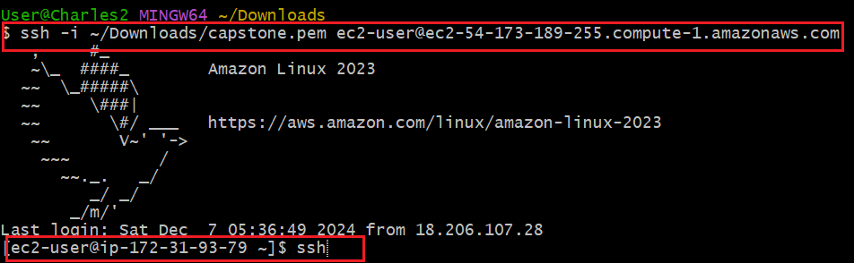
## Cloning the repository on the linux server using SSH
- Generating SSH key pair using `ssh-keygen` syntax
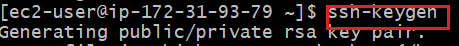
- Displaying and copy the public key
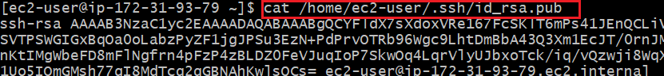
- Adding SSh public key to Gitup account.
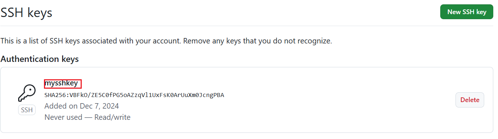
- installing git command
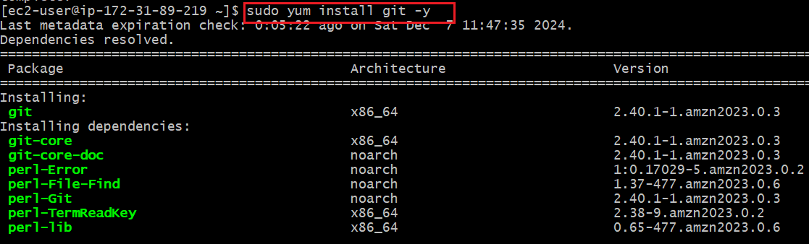
- cloning the gitup account
## Installing web server on EC2
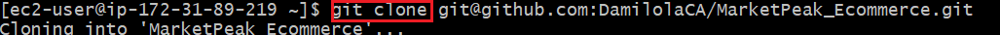
- Installing apache httpd server

- Configuring apache httpd server

- Applying apache configuration and reload

## Accessing website from browser.
- Web browser was opened with public ip of my EC2.
# Continuous Integration and Deployment workflow
To accomondate workflow for developing, testing  anf deploying, version control is created using the following procedure.
## Developing new features
- Creating a new branch using `git branch` syntax
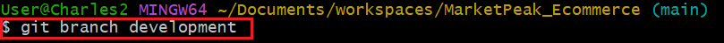
- Switching to new branch using `git checkout development` syntax
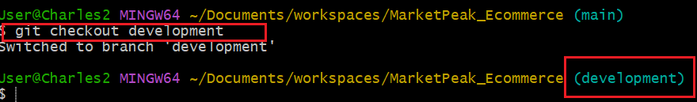
- Adding new features to the website
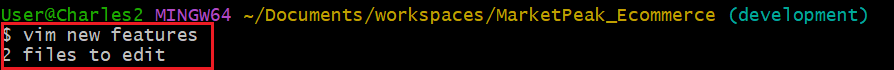
- Staging my changes
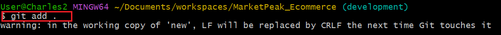
- Commit new update.
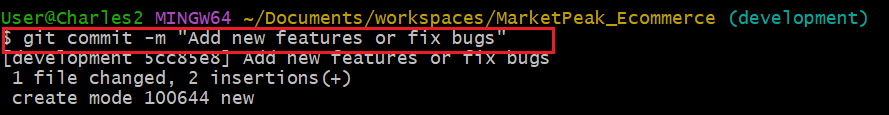
- Create pull request.
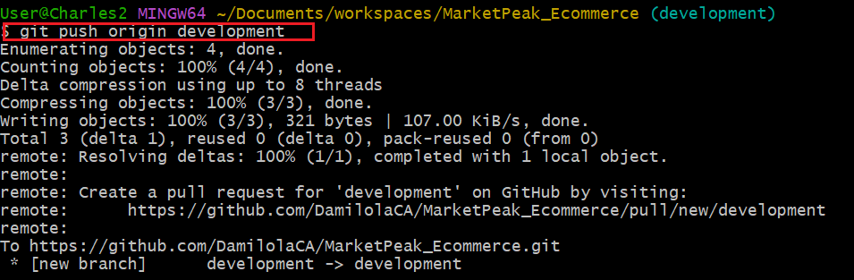
- Switch back to main branch
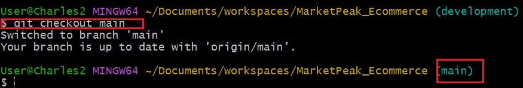
- Merging pull request into main.

- Pushing the merge changes.
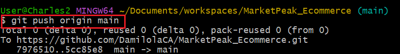
-pulling the latest change on the server
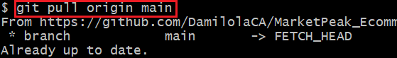
- Restarting the web server
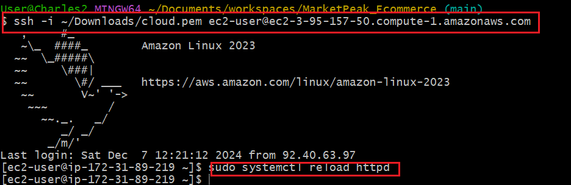
## Testing the new changes
- The new change was observed when the web browser was restarted and it was an expected change.

# Challenges:
During the period of the capstone, I had challenge with commands on after connecting to the server, I needed to install git using `sudo yum` syntax. Also, at interval my server disconnected after launching the web page which makes the web page disappear. This does not provide opportunity for me to explore my website. Additionally, I used Ubuntu(oracle VM) which crashes after some minutes connection is made to the Ec2 server.  I later use git bash for the project which seems ok. Lastly, I realize I had to change the repositoty directory after cloning to the EC2 server which makes me to start over again. 
